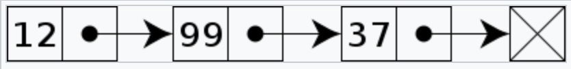
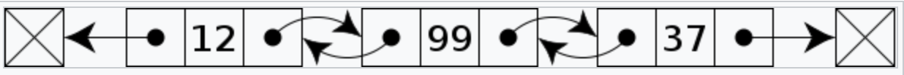
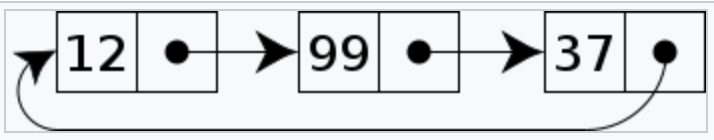

# Linked List

## Definition

In computer science, a [linked list](https://en.wikipedia.org/wiki/Linked_list) is a linear collection of data elements whose order is not given by their physical placement in memory. Instead, each element points to the next. It is a data structure consisting of a collection of nodes which together represent a sequence. In its most basic form, each node contains data, and a reference (in other words, a ​link​) to the next node in the sequence.

## Basic Concepts

### Types

* Singly Linked List
  Singly linked lists contain nodes which have a 'value' field as well as 'next' field, which points to the next node in line of nodes. That means each element only knows what its next element is.
  
* Doubly Linked List
  In a doubly linked list, each node contains, besides the next-node link, a second link field pointing to the previous node in the sequence. That means each element knows what its next element and previous element are.
  
* Circular Linked List
  In the last node of a linked list, the link field often contains a null reference, a special value is used to indicate the lack of further nodes. A less common convention is to make it point to the first node of the list; in that case, the list is said to be circularly linked.
  

### Sentinel node

There is a special node named sentinel node, also called dummy node, in a linked list. It does not store data, just uses as head and tail to simply the boundary judgment.

